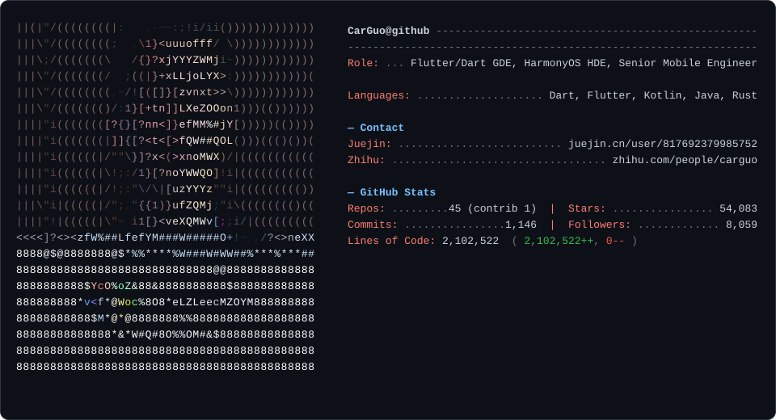

<p>
  
</p>

<details>
<summary>这张卡片是怎么来的</summary>

- 卡片本身是一张 SVG（`dark_mode.svg`），由本仓库的 `gsy_profilecard` 包生成，只提供深色版本（避免白底下 ASCII 头像识别度差）。
- 左侧字符画由 [tools/make_art.py](tools/make_art.py) 一次性从头像图 (`tools/avatar.png`) 生成 `art.json`。
- 右侧字段来自 [profile.toml](profile.toml)（你要改文案，改这里就行；不用动代码）。
- GitHub 数据（repos / stars / followers / commits / LOC）由 [.github/workflows/update.yml](.github/workflows/update.yml) 每天 04:17 UTC 自动刷新一次并 commit 回来。

本地使用：

```bash
make install   # pip install -e ".[dev]"
make update    # 重新生成 dark_mode.svg，需要在环境变量或 env.txt 中提供 ACCESS_TOKEN
make test      # pytest
```

`ACCESS_TOKEN` 只需要 `read:user` + `public_repo` 权限。

</details>

### GSY’s Github


[](https://github.com/anuraghazra/github-readme-stats)


- 🏅[Flutter & Dart GDE](https://developers.google.com/profile/u/gsytech)
- ✨[HDE](https://developer.huawei.com/consumer/cn/programs/personalCenter/personalCenterGuoShuYu)
- 🏆[Open Source Peer Bonus Winners In 2022 - Asher Guo](https://opensource.googleblog.com/2022/09/announcing-the-second-group-of-open-source-peer-bonus-winners-in-2022.html)
- 📘[Google Developer Blog](https://developers.googleblog.com/en/from-offstage-to-onstage-my-experience-of-becoming-a-google-developer-expert/)
- 📖 [《Flutter开发实战详解》](https://www.phei.com.cn/module/goods/wssd_content.jsp?bookid=55960) Author
- 🔥[掘金优秀作者&签约作者](https://juejin.cn/user/817692379985752/posts)
- 🚀[2021 GitHub China Top 99 Impact- CarGuo](https://opensource.win/CarGuo/)
- 🌲Gitee：https://gitee.com/CarGuo
- [](https://gitcode.com/ZuoYueLiang/GSYVideoPlayer/overview) gitcode: https://gitcode.com/ZuoYueLiang


Wrote article on

| Medium                                 | 掘金                                                         | 公众号                                              | 知乎                                       |               CSDN                           | 简书                                            |
| -------------------------------------- | ------------------------------------------------------------ | --------------------------------------------------- | ------------------------------------------ | -------------------------------------------- | ----------------------------------------------- |
| [GSYTech](https://medium.com/@GSYTech) | [click](https://juejin.im/user/582aca2ba22b9d006b59ae68/posts) | [GSYTech](http://img.cdn.guoshuyu.cn/wechat_qq.png) | [click](https://www.zhihu.com/people/carguo) | [click](https://carguo.blog.csdn.net) | [click](https://www.jianshu.com/u/6e613846e1ea) |


|                                   |                                                           |                                                               |                                                        |        |
| -------------------------------------- | ------------------------------------------------------------ | --------------------------------------------------- | ------------------------------------------ | -------------------------------------------- |


